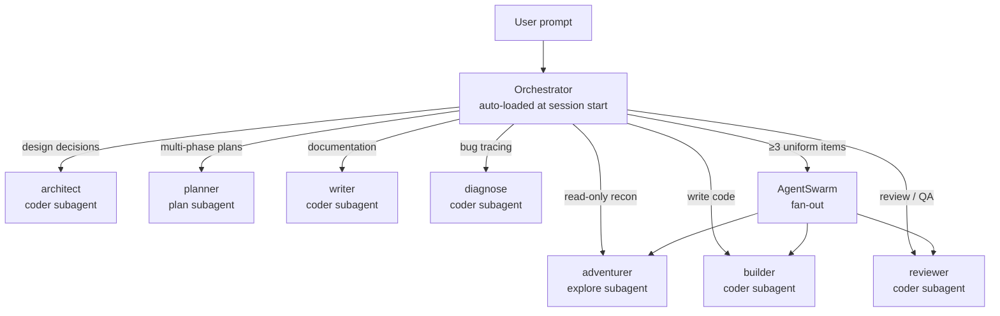

import { LinkCard, CardGrid, Aside } from '@astrojs/starlight/components';

`@maestria/kimi-code` ships one orchestrator skill and 7 specialist skills. Kimi Code's plugin system has only 3 built-in subagent profiles (`coder`, `explore`, `plan`) — the 7 specialist identities are encoded as **persona content** in prompt templates that the orchestrator dispatches to those subagents. The orchestrator auto-loads at session start and routes requests to the right persona based on the routing table below.

## Routing Flow

The orchestrator is the routing layer. It does not implement, debug, or edit code itself — it loads specialist skills via the `Skill` tool and dispatches them to Kimi Code's 3 built-in subagents via `Agent` (1–2 items) or `AgentSwarm` (≥3 uniform items).



## Skill Reference

The subagent column is the Kimi Code profile to dispatch to. The persona constraint column describes what the specialist's SKILL.md body enforces; see [Tool-Layer Safety](#tool-layer-safety) below for the difference between persona text and tool-layer enforcement.

| Skill            | Subagent  | Persona constraint                                                           | When to use                                                                                           |
| ---------------- | --------- | ---------------------------------------------------------------------------- | ----------------------------------------------------------------------------------------------------- |
| **orchestrator** | main      | Never implement, never edit. Routes to the 7 specialists only.               | Multi-step or multi-file work, or any task spanning N≥3 independent items                             |
| **builder**      | `coder`   | Default for write work — full Write/Edit/Bash access                         | Concrete, scoped, atomic implementation task with no design ambiguity (recon and design already done) |
| **adventurer**   | `explore` | **Read-only** — Bash limited to read-only commands (`ls`, `git log`, `grep`) | Understanding unfamiliar code, tracing dependencies, mapping a module before editing                  |
| **architect**    | `coder`   | Bash for validation (`which`, `npm view`) only — no state-mutating work      | Technology choices, "should we use X or Y", evaluating options with long-term consequences            |
| **planner**      | `plan`    | No Write, no Edit, no Bash — pure markdown output                            | Multi-phase features requiring ordered work, migration plans, complex feature rollouts                |
| **reviewer**     | `coder`   | **Do not edit files** — structured feedback only                             | Pre-merge review, security audit, post-implementation validation                                      |
| **writer**       | `coder`   | Default for write work — full Write/Edit/Bash access                         | READMEs, API docs, changelogs, ADR transcription, technical prose                                     |
| **diagnose**     | `coder`   | Read/Grep/Bash for investigation, Write/Edit only for the confirmed fix      | Regressions, cryptic errors, performance issues, "why is X happening"                                 |

## Tool-Layer Safety

<Aside type="caution">
  The persona constraints in the table above are **advisory only** — they live in the SKILL.md
  prompt text, not the tool layer. A misbehaving subagent can still write or edit files unless the
  matching `[[permission.rules]]` block is present in `~/.kimi-code/config.toml`. See the
  [Installation Guide](/kimi-code/getting-started/installation/) for the conservative minimum.
</Aside>

For example, the `reviewer` SKILL.md opens with "!!! DO NOT EDIT FILES" — but the `reviewer` persona is dispatched to the `coder` subagent, which has Write and Edit tools. The persona text is what makes the model _want_ to behave correctly; the `[[permission.rules]]` block is what makes it _unable_ to misbehave. The two are complementary: the persona carries methodology, the rules enforce boundaries.

## Default Pipeline (Non-Trivial Work)

For multi-file, cross-module, or new-feature work, the default pipeline is:

```
load relevant skills → AgentSwarm (≥3 uniform items) OR single Agent (1–2 items)
  → @builder (coder) for implementation → @reviewer (coder, no-edit) for validation
```

Skipping steps is allowed only with explicit justification in the handoff. The final `reviewer` step is non-negotiable after a `builder` change — this is the maker/checker split.

## Skill Prescription

Every skill's SKILL.md follows the same 4-section prescription pattern. The full reference is in [Contributing](/kimi-code/contributing/#skill-prescription), summarized here:

- **Always load** — Skills that this specialist's role requires unconditionally (e.g., `diagnose` loads the `diagnose` methodology skill)
- **Load on trigger** — Conditional skills matched to specific situations (e.g., `architect` loads `c4-architecture` when a container diagram is needed)
- **Defer to specialist** — Skills that belong to a different persona's domain (e.g., `humanizer` is the `writer`'s job, not the `builder`'s)
- **Skip if** — Conditions under which no skill load is needed at all

This pattern keeps each specialist focused on its own methodology while routing edge cases to the right persona.

## See Also

- [Installation & Setup](/kimi-code/getting-started/installation/) — including `[[permission.rules]]` for tool-layer safety
- [Workflow Patterns](/kimi-code/guide/workflow-patterns/) — practical examples for each skill
