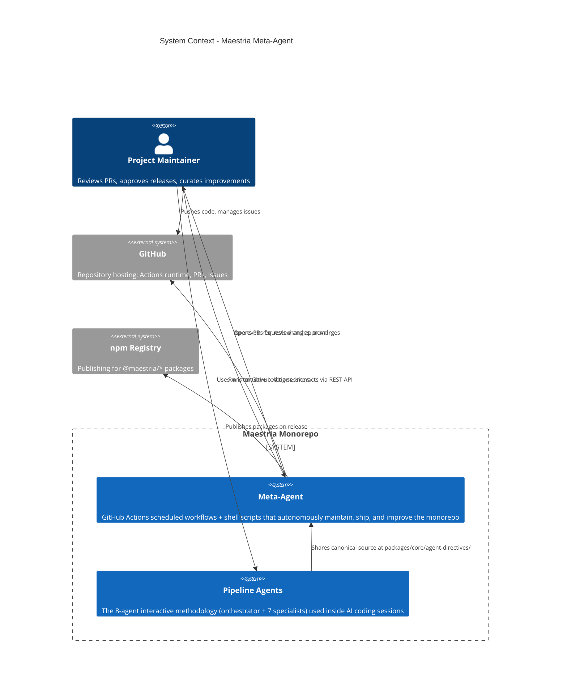
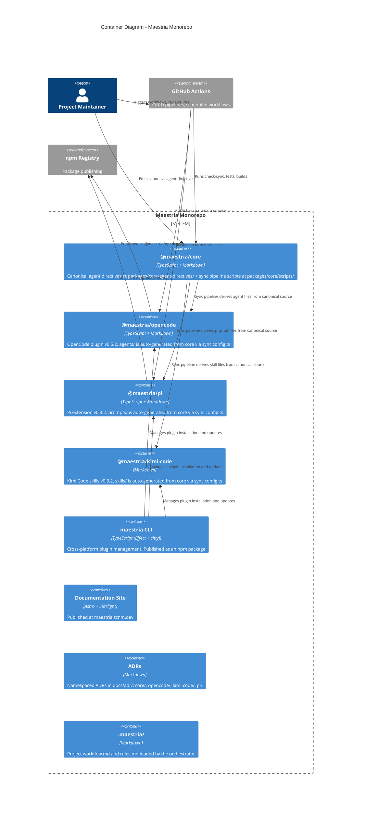

# Architecture: Maestria Meta-Agent

## Executive Summary

The maestria meta-agent is an autonomous system that stewards the maestria monorepo — maintaining code quality, shipping releases, and proposing improvements — without a separate framework or agent directory. It runs as GitHub Actions scheduled workflows that invoke the same shell scripts, build tools, and quality gates a human maintainer would use. All changes flow through PR review; the agent never pushes directly to main.

**What it does:**

- Runs quality checks daily (tests, lint, typecheck, sync consistency)
- Audits dependencies and flags drift
- Creates changesets, bumps versions, and opens PRs
- Publishes packages to npm on merge
- Proposes improvements to agent directives based on analysis
- Detects gaps in architecture decision records

**Key design choices:**

- **Canonical source as single source of truth** — all agent prompts originate in `packages/core/agent-directives/` and are synced to platform-specific locations via a config-driven pipeline
- **GitHub Actions as runtime** — no separate agent framework; scheduled YAML workflows run standard `bash`, `pnpm`, and `tsx` commands
- **PR-based approval** — every change proposed by automation goes through a human review cycle. No direct pushes to main.
- **Vendor-independent** — uses only generic CI/CD primitives available in any Git hosting platform. Portable to GitLab, self-hosted runners, etc.
- **Local-first** — all tools run in-repo. No external services, no sandbox, no credential brokering beyond the CI runner's built-in `GITHUB_TOKEN`.

This design aligns with maestria's design patterns in [`PATTERNS.md`](../PATTERNS.md) (Pipeline Composition, Maker/Checker Split) and fulfills the curation-driven evolution vision defined in [`VISION.md`](../VISION.md).

---

## System Context

The meta-agent operates within the monorepo's existing infrastructure. It is not a separate application — it is the existing tooling (scripts, CI workflows, sync pipeline) running on a schedule.



### Actors

| Actor | Role | Interactions with Meta-Agent |
| --- | --- | --- |
| **Project Maintainer** | Human who curates the project, reviews PRs, and approves releases | Reviews and merges automated PRs; triggers release workflows; provides input on improvement proposals |
| **Pipeline Agents** | The interactive 8-agent system (orchestrator + 7 specialists) | Shares the same canonical source; the meta-agent proposes changes that improve their prompts and rules |
| **GitHub** | External hosting platform | Runs the scheduled workflows via GitHub Actions; hosts the repo and PRs |
| **npm Registry** | External package registry | Receives published packages when the release workflow runs |

---

## Current Foundation

The meta-agent builds on infrastructure that is already shipped and operational.

### Canonical Source Model

All agent prompts are authored once in a platform-neutral format and derived per platform through a config-driven sync pipeline:



### Shipped Components

| Component | Location | Version | Role |
| --- | --- | --- | --- |
| **Core directives** | `packages/core/agent-directives/` | 0.3.1 | Canonical source for all 8 agent prompts + rules |
| **Sync pipeline** | `packages/core/scripts/sync.ts` | 0.3.1 | TypeScript script that derives platform files from canonical source |
| **OpenCode plugin** | `packages/opencode/` | 0.5.2 | Published npm package with auto-generated agents/ |
| **Pi extension** | `packages/pi/` | 0.3.2 | Published npm package with auto-generated prompts/ |
| **Kimi Code plugin** | `packages/kimi-code/` | 0.3.2 | Plugin with auto-generated skills/ |
| **CLI** | `apps/maestria-cli/` | 0.3.0 | Cross-platform plugin management (`maestria install`, `update`, `status`) |
| **Docs site** | `apps/docs/` | — | Astro + Starlight documentation at maestria.sznm.dev |
| **Project workflow** | `.maestria/workflow.md` | — | Sequencing guidance loaded by orchestrator |
| **Project rules** | `.maestria/rules.md` | — | Non-negotiable project rules propagated to all agents |
| **ADRs** | `docs/adr/` | — | Namespaced ADRs: core/, opencode/, kimi-code/, pi/ |

### How the Sync Pipeline Works

The sync pipeline is the core architectural pattern that the meta-agent maintains:

```
packages/core/agent-directives/
  ├── specialists/
  │   ├── adventurer.md, architect.md, builder.md, diagnose.md,
  │   ├── orchestrator.md, planner.md, reviewer.md, writer.md
  └── rules.md
        │
        │  scripts/sync-all iterates over packages/*/sync.config.ts,
        │  runs packages/core/scripts/sync.ts per plugin
        │
        ▼
  ┌──────────────┬──────────────┬──────────────┐
  │ opencode     │ pi           │ kimi-code    │
  │ sync.config  │ sync.config  │ sync.config  │
  │     │        │     │        │     │        │
  │     ▼        │     ▼        │     ▼        │
  │ agents/*.md  │ prompts/*    │ skills/*/    │
  └──────────────┴──────────────┴──────────────┘
```

Each `sync.config.ts` declares how canonical content maps to platform-specific files: find/replace substitutions, frontmatter injection, output path overrides. The tool supports `--check` (CI mode: exit 1 if drift exists) and `--diff` (show changes).

### CI/CD Pipelines

| Workflow | Trigger | Purpose |
| --- | --- | --- |
| `check-sync` (part of `vp check`) | Every commit | Verifies canonical source matches generated platform files |
| Version packages | Manual / Changesets | Bumps versions and generates changelogs |
| Release | Merge to main | Publishes packages to npm |

---

## Meta-Agent Architecture

### How It Works

The meta-agent is a collection of GitHub Actions scheduled workflows, each defining a job that runs standard commands in the checked-out monorepo:

1. A cron trigger fires the workflow
2. The workflow checks out the repo, installs dependencies
3. It runs the appropriate checks or operations (`pnpm test`, `scripts/check-sync`, `pnpm changeset`, etc.)
4. If the operation creates a change (e.g., a version bump or proposal), it opens a PR for human review
5. Results may be reported via GitHub Issues or commit status checks

No separate agent runtime is involved. The "agent" is the sequence of shell commands defined in YAML, orchestrated by GitHub Actions.

### Operations

| Operation | Cadence | What It Does |
| --- | --- | --- |
| **Daily health check** | Daily | Runs `pnpm check`, `pnpm test`, `scripts/check-sync`. Reports failures. |
| **Dependency audit** | Weekly | Runs `pnpm outdated --json`, identifies packages >2 majors behind. Opens issue. |
| **Release pipeline** | On merge to main | Creates changesets, bumps versions, publishes to npm, verifies cross-platform sync |
| **Sync health report** | Weekly | Compares canonical source to generated platform files. Reports any structural drift. |
| **Improvement proposal** | Monthly | Analyzes CI logs, identifies recurring issues, opens PR with suggested directive improvements |
| **ADR gap detection** | Monthly | Checks if recent changes have corresponding ADRs. Opens issue for missing documentation. |

### Design Principles

| Principle | Description |
| --- | --- |
| **Vendor-independent** | Uses only shell scripts, TypeScript, and GitHub Actions. No proprietary agent framework. Portable to other CI providers. |
| **Local-first** | All operations run in-repo. Uses `execSync`-style command execution via GitHub Actions `run:`. No external services needed. |
| **Incremental** | Each new operation builds on existing scripts and workflows. No big-bang changes. |
| **PR-gated** | Every change that modifies files goes through a pull request. The agent creates branches, opens PRs, and waits for human review. |
| **Transparent** | All operations are defined in version-controlled YAML and shell scripts. Nothing runs invisibly. |

### Comparison with the Interactive Pipeline

| Dimension               | Interactive Pipeline (8 agents) | Meta-Agent (this system)     |
| ----------------------- | ------------------------------- | ---------------------------- |
| When it runs            | During AI coding sessions       | On schedule (GitHub Actions) |
| Who invokes it          | The user                        | Cron triggers                |
| What it does            | Code, design, debug, review     | Check, sync, ship, propose   |
| How it produces changes | Edits files during session      | Opens PRs for review         |
| Runtime                 | OpenCode / Kimi Code / Pi       | GitHub Actions               |
| Scope                   | Single task or feature          | Repo-wide maintenance        |

---

## Key Design Decisions

### Decision 1: Canonical Source as Single Source of Truth

**Context:** The monorepo has 4 packages, each needing platform-specific variants of the same 8 agent prompts. An earlier approach involved maintaining independent copies per package, which drifted over time.

**Decision:** Author all agent prompts once at `packages/core/agent-directives/` in pure Markdown (no frontmatter, no platform-specific syntax). A config-driven sync pipeline (`packages/core/scripts/sync.ts`) derives platform-specific files, applying string-based replacements and frontmatter injection per `sync.config.ts`.

**Rationale:** Eliminates drift between platform agent files. Adding a 4th platform requires only a new `sync.config.ts` — no pipeline changes. Core content stays readable Markdown, not TypeScript or templates.

**Consequences:**

- Positive: Single edit point for methodology changes; CI guard (`check-sync`) catches drift
- Negative: Developers must learn to edit canonical source, not generated copies; sync step required after every canonical source change

**Status:** Accepted. Shipped in `@maestria/core` v0.3.1.

### Decision 2: GitHub Actions as Runtime

**Context:** The meta-agent needs to run scheduled operations. Options included a dedicated agent framework (with its own runtime, tools, and state management) or using the existing CI platform.

**Decision:** Use GitHub Actions scheduled workflows as the meta-agent runtime. Each operation is a YAML workflow that checks out the repo, installs dependencies, and runs shell commands. No separate agent framework.

**Rationale:** The monorepo already uses GitHub Actions for CI/CD. Adding a separate agent framework would introduce a new dependency, new failure modes, and credential management overhead. The operations the meta-agent performs are all expressible as shell commands — no LLM reasoning is needed for most maintenance tasks.

**Consequences:**

- Positive: Zero new infrastructure; all actions auditable via workflow logs; portable to other CI providers with minimal YAML changes
- Negative: No built-in state persistence between runs (rely on git history and CI logs); no interactive debugging (use `workflow_dispatch` for testing)

**Status:** Implemented (phase 2-3).

### Decision 3: PR-Based Approval for All Changes

**Context:** The meta-agent can propose changes (version bumps, sync fixes, prompt improvements). These changes need human oversight.

**Decision:** Every change the meta-agent produces — version bumps, dependency updates, prompt edits, improvement proposals — goes through a pull request. The agent creates a branch, opens a PR, and stops. A human must review and merge.

**Rationale:** Aligns with the Maker/Checker Split pattern in `PATTERNS.md` and the curation-driven evolution principle in `VISION.md`. No automated push to main, no implicit releases.

**Consequences:**

- Positive: Full diff visibility; alignment with project governance; easy to skip or modify proposals before they land
- Negative: Adds latency between detection and fix; requires human to check pending PRs regularly

**Status:** Design principle. Implemented incrementally as each operation is added.

### Decision 4: Independent Platform Packages with Shared Core

**Context:** Different platforms (OpenCode, Kimi Code, Pi) have different plugin formats, tool names, and permission models. A monolith package would couple them all together.

**Decision:** Each platform gets its own publishable package (`@maestria/opencode`, `@maestria/pi`) that independently consumes the canonical core. The core is a private workspace package (`@maestria/core`) that contains the Markdown source and sync tooling — it is never published to npm.

**Rationale:** Platforms evolve independently. An OpenCode release should not block a Pi release. The CLI tool (`apps/maestria-cli/`) provides a unified management interface across all platforms.

**Consequences:**

- Positive: Independent release cycles; each package has its own version, README, and changelog; adding a platform doesn't affect existing packages
- Negative: N packages to publish on release day; CI must run sync verification across all packages

**Status:** Accepted (CORE-002, CORE-005). Implemented in current monorepo.

### Decision Matrix: Canonical Source + Sync vs. Agent Framework

During the design phase, we evaluated whether the meta-agent should be built on a dedicated agent framework or on the existing canonical-source-sync infrastructure.

| Factor | Canonical Source + Sync (Chosen) | Dedicated Agent Framework (Rejected) |
| --- | --- | --- |
| **Architecture** | Markdown source + TypeScript sync pipeline + shell scripts | Full agent runtime with tools, skills, and channels |
| **Deployment** | In-repo scripts running in GitHub Actions | Separate agent application deployed to CI or server |
| **Maintenance ops** | `bash scripts/check-sync`, `pnpm test`, etc. | Agent-specific tool calls (e.g., `execSync` wrappers) |
| **State persistence** | Git history + CI logs | Durable streams / session recording |
| **Session analysis** | Manual review of CI logs | Automated pattern detection via LLM |
| **Framework dependency** | None — generic CI primitives | Tight coupling to framework APIs and release cycles |
| **Learning curve** | Familiar to any developer who knows bash and YAML | Requires learning agent framework concepts and APIs |
| **When suitable** | Scheduled, deterministic operations | Interactive, reasoning-heavy tasks |

The decision was to start with the simpler, framework-free approach and only adopt agent framework patterns if the complexity of autonomous operations justifies it.

---

## Relationship to ADRs

The meta-agent architecture builds on existing ADRs and may motivate new ones:

### Existing ADRs

| ADR | Title | Relevance to Meta-Agent |
| --- | --- | --- |
| CORE-000 | ADR Structure | Establishes namespaced ADR layout used throughout these plans |
| CORE-001 | Global Rules Scope | Defines which rules apply across all agents; meta-agent must respect these |
| CORE-002 | Plugin Architecture | Establishes pure-plugin model; meta-agent operates on the monorepo, not inside a plugin runtime |
| CORE-005 | Core Sync Bridge | The sync pipeline is the single most critical infrastructure the meta-agent maintains |
| CORE-006 | Project Workflow Protocol | `.maestria/workflow.md` and `.maestria/rules.md` govern how the project is worked on |
| CORE-007 | CLI Package for Plugin Management | The CLI tool at `apps/maestria-cli/` is a management surface the meta-agent can invoke |
| OC-003 | Keyword-Triggered Workflow Modes | `fein`/`sonar`/`blitz` modes — meta-agent does not use these (it is not an interactive session) |
| OC-004 | Commit Authorization Rules | Meta-agent must follow the same commit protocol when creating PR branches |
| PI-001 | Pi Rules Injection | Platform-specific sync target; meta-agent verifies sync consistency |
| PI-002 | Pi Compaction State Preservation | Platform-specific sync target |
| KC-000 | Kimi Code Distribution | Platform-specific sync target |
| KC-001 | Kimi Code Architecture | Platform-specific sync target |

### Potential New ADRs

| Proposed ADR | Topic | When Needed |
| --- | --- | --- |
| CORE-008 | Meta-Agent Operation Model | When phase 2 (automated maintenance) is fully specified |
| CORE-009 | Automated Release Protocol | When phase 3 (automated shipping) defines release workflow |
| CORE-010 | Self-Improvement Pipeline | When phase 4 defines how improvement proposals are generated and reviewed |

---

## References

### Maestria

- [VISION.md](../VISION.md) — Project vision and principles
- [PATTERNS.md](../PATTERNS.md) — Design patterns catalog
- [README.md](./README.md) — Meta-agent plans overview
- [implementation-plan.md](./implementation-plan.md) — Phased build plan

### ADRs

- [CORE-005: Core Sync Bridge](../adr/core/ADR-CORE-005-shared-agent-directives-core-sync.md)
- [CORE-006: Project Workflow Protocol](../adr/core/ADR-CORE-006-project-workflow-protocol.md)
- [CORE-007: CLI Package for Plugin Management](../adr/core/ADR-CORE-007-cli-package-plugin-management.md)
- [CORE-002: Plugin Architecture](../adr/core/ADR-CORE-002-plugin-architecture.md)

### GitHub

- [maestria monorepo](https://github.com/agustinusnathaniel/maestria)
- [@maestria/opencode on npm](https://www.npmjs.com/package/@maestria/opencode)
- [@maestria/core on npm](https://www.npmjs.com/package/@maestria/core)
